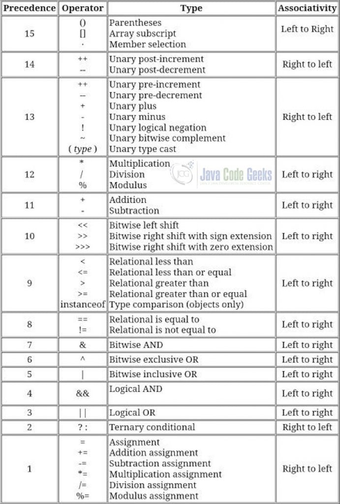

Java Fundamentals
================

1. Structure of a Java Program
-----------------------------
- Main Method:
  - Entry point of a Java program.
  - Syntax: public static void main(String[] args)
  - Must be public, static, return void, and accept a String array as parameter.
  - Example:
    public class HelloWorld {
        public static void main(String[] args) {
            System.out.println("Hello, World!");
        }
    }
- Class Declaration:
  - A Java program is defined within a class.
  - Class name must match the file name (e.g., HelloWorld.java for above example).
  - Syntax: public class ClassName { ... }
  - Classes encapsulate fields and methods.

2. Compiling and Running Java Programs
-------------------------------------
- Compiling:
  - Use 'javac' command to compile Java source code (.java) into bytecode (.class).
  - Example: javac HelloWorld.java
  - Creates HelloWorld.class if no errors.
- Running:
  - Use 'java' command to execute the bytecode.
  - Example: java HelloWorld
  - JVM interprets or compiles bytecode to machine code.
  - Note: Do not include .class extension in the 'java' command.
- Requirements:
  - JDK must be installed and configured (PATH environment variable).
  - Source file must have a valid main method to run.

3. Roles of JDK, JRE, JVM
-------------------------
- JDK (Java Development Kit):
  - Comprehensive toolkit for Java development.
  - Includes JRE, compiler (javac), tools (javadoc, jar), and libraries.
  - Required for writing, compiling, and debugging Java programs.
  - Example: JDK 17 is used for Java SE 17 development.
- JRE (Java Runtime Environment):
  - Subset of JDK for running Java applications.
  - Includes JVM and standard class libraries.
  - Needed by end-users to execute Java programs without development tools.
- JVM (Java Virtual Machine):
  - Abstract machine that executes Java bytecode.
  - Provides platform independence (write once, run anywhere).
  - Responsibilities:
    - Loads and verifies bytecode.
    - Manages memory (heap, stack).
    - Performs garbage collection.
  - Specific to the operating system but provides a consistent runtime environment.

